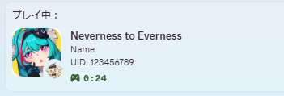

# NTERPC



# 概要
**Neverness to Everness**（NTE）の起動を検知し、Discordのアクティビティに表示するプログラムです。<br>
アプリケーションはタスクトレイに格納され、右クリックの Exit を押すことでプログラムを終了できます。<br>
また、動作状況はlogフォルダ先の**ログファイル**に記述されます。

# アクティビティ設定
GUIは無いため、フォルダに同梱されている**config.json**をメモ帳等のアプリで開き、直接編集してください。

## Player
プレイヤー名を**文字列**で設定します。<br>

## UID
ユーザIDを**数値**で入力してください。この項目ではダブルクォーテーション「`""`」は不要です。

## UIDVisible
UIDの表示可否を設定します。<br>
「`true`」または「`false`」で指定してください。<br>
`true`の場合は、UIDをそのまま表示します。<br>
`false`の場合、Discord上には「__****__」と表示されます。

## BtnLabel
Discordアクティビティの**ボタン名**を設定します。

## BtnUrl
Discordアクティビティの**ボタンURL**を設定します。

## 例
```json
{
  "Player": "Name",
  "UID": 123456789,
  "UIDVisible": true,
  "BtnLabel": "公式サイト",
  "BtnUrl": "https://nte.perfectworld.com/"
}
```

# 自動起動について
タスクスケジューラなどの定時に起動するアプリケーションと併用することで、起動の手間が省けて便利です。<br>

- [ログイン時にプログラムを起動させる(タスクスケジューラ)](https://bhunji2000.hatenadiary.org/entry/20091128/1259404410)

# アンインストール方法
NTERPCのフォルダを削除してください。

# 注意事項
* ボタンURLに**有害なサイト**を貼らないでください。
* NTEの今後のバージョンアップデートにより<INS>動作しなくなる可能性</INS>があります。